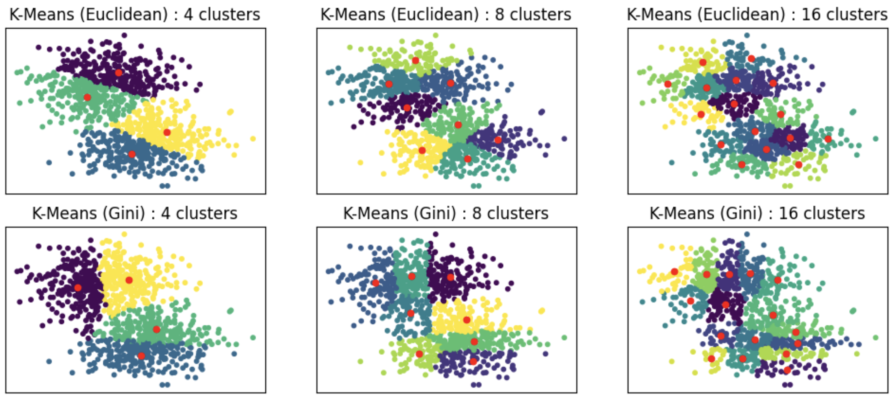

# KNN and K-means in Gini Prametric Spaces

## Description

This project introduces innovative enhancements to the K-means and K-nearest neighbors (KNN) algorithms by leveraging the concept of Gini prametric spaces. Unlike traditional distance metrics, Gini prametrics combine value-based and rank-based measures, offering greater robustness to noise and outliers. Key contributions of this work include:

1. Proposing a novel Gini prametric that integrates rank information alongside value distances.
2. Developing a Gini K-means algorithm that guarantees convergence and demonstrates resilience to noisy data.
3. Introducing a Gini KNN method that rivals state-of-the-art approaches, such as Hassanat’s distance, particularly in noisy environments.

Extensive experimental evaluations on 14 datasets from the UCI repository showcase the superior performance and efficiency of Gini-based algorithms in clustering and classification tasks. This project opens new avenues for leveraging rank-based prametrics in machine learning and statistical analysis.



---

## Features

- [x] Gini prametric for robust distance measurement.
- [x] Gini K-means algorithm with noise-resilient clustering.
- [x] Gini KNN for enhanced classification accuracy in noisy datasets.
- [x] Experimental validation on diverse UCI datasets.

---

## Prerequisites

Before starting, make sure you have the following tools installed:

- Libraries: numpy, scikit-learn (detailed in `requirements.txt`).

---

## Installation

### For macOS/Linux:

1. Clone this repository:
   ```bash
   git clone git@github.com:giniknnkmeans/KNN_Kmeans_Gini_prametric.git
   ```

2. Create a virutal environment :
   ```bash
   python -m venv gini_env
   ```

3. Activate the environment:
   ```bash
   source gini_env/bin/activate
   ```

4. Install packages:
   ```bash
   pip install -r requirements.txt
   cd  scikit_learn
   ```
   
5. Install scikit_learn:
   ```bash
   make install
   ```

   
### For Windows:

1. Clone this repository:
   ```bash
   git clone git@github.com:giniknnkmeans/KNN_Kmeans_Gini_prametric.git
   ```

2. Create a virutal environment :
   ```bash
   python -m venv gini_env
   ```

3. Activate the environment:
   ```bash
   source gini_env/bin/activateSet - ExecutionPolicy - Scope CurrentUser RemoteSigned
   cd gini_env
   .\Scripts\activate
   cd ..
   ```

4. Install packages:
   ```bash
   pip install -r requirements.txt
   cd  scikit_learn
   ```
   
5. Install build_tools from this website https://visualstudio.microsoft.com/fr/visual-cpp-build-tools/ :
  
6. In VSCode's terminal run: 
   ```bash
   cd scikit_learn
   python setup.py install
   ```
---

## Usage

An example on how to use KNN, Kmeans and Hierarchical Clustering is given in the KNN.py, Kmeans.py and hierarchical_clustering.py files.
First, you will have to activate the gini_env that you created earlier on and then you can execute the files.

---

## License

This project is licensed under the [MIT](LICENSE) License. See the LICENSE file for details.

---
